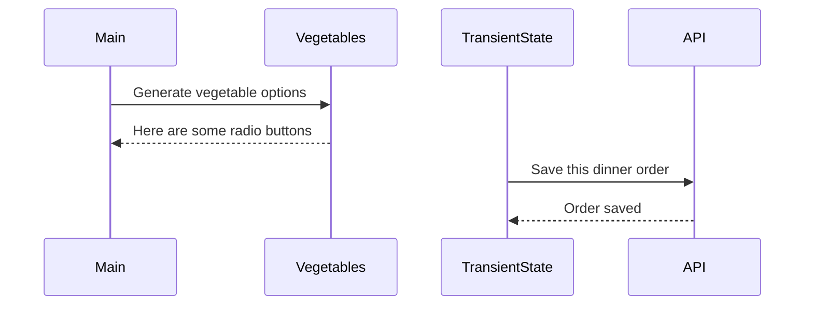

# Events and State Self-Assessment

> 🧨 Make sure you answer the vocabulary and understanding questions at the end of this document before notifying your coaches that you are done with the project

## Setup

1. Make sure you are in your `workspace` directory
1. `git clone {github repo SSH string}`
1. `cd` into the directory it creates
1. `code .` to open the project code
1. Use the `serve` command to start the web server
1. Open the URL provided in Chrome

## Requirements

### Initial Render

1. All 10 base dishes should be displayed as radio input options.
1. All 9 vegetables should be displayed as radio input options.
1. All 6 side dishes should be displayed as radio input options.
1. All previously purchases meals should be displayed below the meal options. Each purchase should display the primary key and the total cost of the purcahsed meal.

### State Management

1. When the user selects an item in any of the three columns, the choice should be stored as transient state.
1. When a user makes a choice for all three kinds of food, and then clicks the "Purchase Combo" button, a new sales object should be...
    1. Stored as permanent state in your local API.
    1. Represented as HTML below the **Monthly Sales** header in the following format **_exactly_**. Your output will not have zeroes, but the actual amount.
        ```html
        Receipt #1 = $00.00
        ```
   1. The user's choices should be cleared from transient state once the purchase is made.

## Design

Given the description and animation above...

1. Create an ERD for this application before you begin.
1. Make a list of what modules need to be created to make your application as modular as possible. Create a **Dependency Graph** for the project to be reviewed once you are complete with the assessment.
1. Create a **Sequence Diagram** that visualizes what your algorithm is for this project. We'll give you a minimal starting point.



## Vocabulary and Understanding

> 🧨 Before you click the "Assessment Complete" button on the Learning Platform, add your answers below for each question and make a commit. It is your option to request a face-to-face meeting with a coach for a vocabulary review.

1. Should transient state be represented in a database diagram? Why, or why not?
   > No, transient state shouldn't be represented in a database diagram (ERD). The ERD represents permanent data storage (or, in other words, entities that exist in the database). Transient state only exists in memory on the client side while the website is running so it isn't something that persists (at least not until it is POSTed).
2. In the **FoodTruck** module, you are **await**ing the invocataion of all of the component functions _(e.g. sales, veggie options, etc.)_. Why must you use the `await` keyword there? Explain what happens if you remove it.
   > We need to use `await` here because each of those functions make asynchronous API calls to fetch data before building its HTML string. Using `await` ensures the data has finished loading before the HTML string is generated and returned. If we remove the `await`, the functions would return unresolved Promise Objects instead of actual HTML, causing the page to display incomplete or missing content since the API response hasn't arrived yet.
3. When the user is making choices by selecting radio buttons, explain how that data is retained so that the **Purchase Combo** button works correctly.
   > Once a user selects a radio button, a `change` event is triggered calling it's corresponding `handleXXXSelection` function. The handler then invokes `setXXXX` function to update the transient state with the user's current choice. Once the **Purchase Combo** button is clicked, that event listener attached to it triggers the `placeOrder()` function which reads those stored selections from the transient state and sends a **POST** request to the database to record a new order.
4. You used the `map()` array method in the self assessment _(at least, you should have since it is a learning objective)_. Explain why that function is helpful as a replacement for a `for..of` loop.
   > The `.map()` method is helpful because it creates a new array by transforming each element of an existing array through a callback function. This makes it a clean and easy-to-read way to generate new data or HTML without manually managing an output array or using loop counters. In contrast, a `for..of` loop requires you to explicitly push items into a new array, while `.map()` automatically handles that transformation and returns the updated array in one single step.